# Online Payment Fraud Detection

## Table of Contents
- [Introduction](#introduction)
- [Dataset Description](#dataset-description)
  - [Source](#source)
  - [Number of Features and Data Points](#number-of-features-and-data-points)
  - [Problem Type](#problem-type)
  - [Feature Types](#feature-types)
- [Data Analysis](#data-analysis)
  - [Categorical Feature](#categorical-feature)
  - [Correlation Analysis](#correlation-analysis)
  - [Imbalanced Dataset](#imbalanced-dataset)
- [Data Pre-Processing](#data-pre-processing)
  - [Feature Selection](#feature-selection)
  - [Handling Null Values](#handling-null-values)
  - [Duplicate Records](#duplicate-records)
- [Feature Scaling](#feature-scaling)
- [Encoding Categorical Data](#encoding-categorical-data)
- [Data Splitting](#data-splitting)
- [Model Selection](#model-selection)
  - [Scatter Plot](#scatter-plot)
  - [Target Class Balance](#target-class-balance)
  - [Model Choices](#model-choices)
- [Model Training and Testing](#model-training-and-testing)
  - [Logistic Regression](#logistic-regression)
  - [Decision Trees](#decision-trees)
  - [Naive Bayes](#naive-bayes)
- [Comparison Analysis](#comparison-analysis)
  - [Accuracy Scores](#accuracy-scores)
  - [Precision and F1-Score](#precision-and-f1-score)
  - [Macro Average](#macro-average)
  - [Weighted Average](#weighted-average)
- [Conclusion](#conclusion)

---

## Introduction
This project is a machine learning classification model to detect fraudulent transactions in online payments. The dataset used is highly imbalanced, with far more non-fraudulent transactions than fraudulent ones. The project explores multiple algorithms and techniques to address the imbalance and improve fraud detection.

## Dataset Description
### Source
The dataset is available on Kaggle.

### Number of Features and Data Points
- **Total features:** 11
- **Total data points:** 6,362,620
- **Selected features:** 8 key attributes (e.g., transaction type, amount, new balances, fraud flag)

### Problem Type
This is a binary classification problem where the target variable **isFraud** has two classes:
- 1: Fraudulent transaction
- 0: Non-fraudulent transaction

### Feature Types
- **Categorical Features**: Transaction type (cash-in, cash-out, debit, payment, transfer)
- **Numerical Features**: Amount, old and new balance of both origin and destination accounts
- **Target Variable**: isFraud (binary classification)
- **Additional Flags**: isFlaggedFraud (potential fraud flag)

## Data Analysis
### Categorical Feature
Analysis showed that fraud occurs only in **cash-out** or **transfer** transactions.

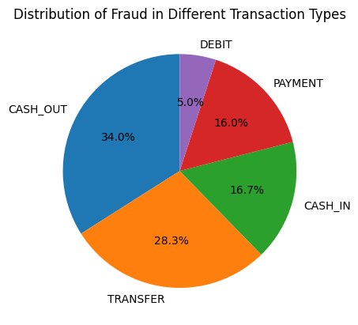

### Correlation Analysis
A correlation matrix showed:
- **oldbalanceOrg** and **newbalanceOrg** are highly correlated.
- **oldbalanceDest** and **newbalanceDest** are highly correlated.

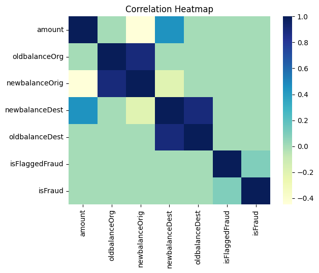

### Imbalanced Dataset
Fraud cases make up a small fraction of the dataset, indicating a significant class imbalance.

## Data Pre-Processing
### Feature Selection
Dropped irrelevant features like **step, nameOrig, nameDest**. Also, **oldbalanceOrg** and **oldbalanceDest** were dropped due to redundancy.

### Handling Null Values
- The **amount** feature contained 63,626 null values, which were imputed with the mean.

### Duplicate Records
- No duplicate values found.

## Feature Scaling
- The **amount, newbalanceOrig, and newbalanceDest** distributions were examined.
- Applied **MinMaxScaler, StandardScaler, and RobustScaler** for normalization.

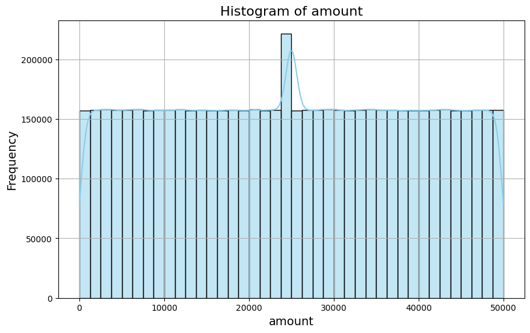
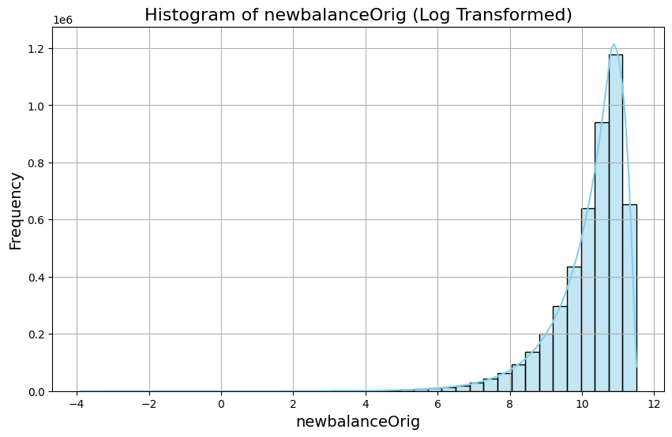
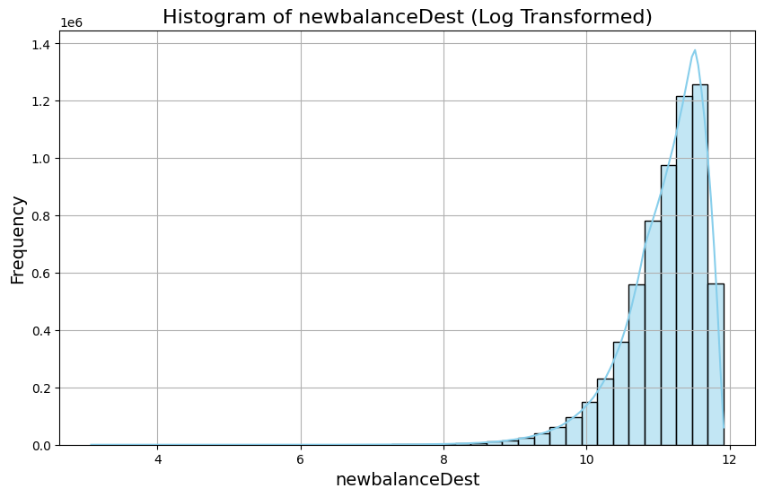

## Encoding Categorical Data
- The **transaction type** feature had five unique classes: 'TRANSFER', 'CASH_OUT', 'CASH_IN', 'PAYMENT', and 'DEBIT'.
- Applied **One-Hot Encoding**.

## Data Splitting
- **Train-Test Split:** 70% training, 30% testing.
- **Stratified Splitting:** Used to handle class imbalance.
- **Random State:** 42 (to ensure reproducibility).

## Model Selection
### Scatter Plot
- A scatter plot of the dataset confirmed a **binary classification problem**.

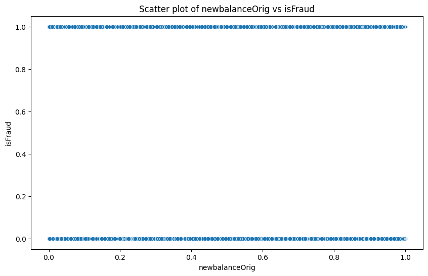
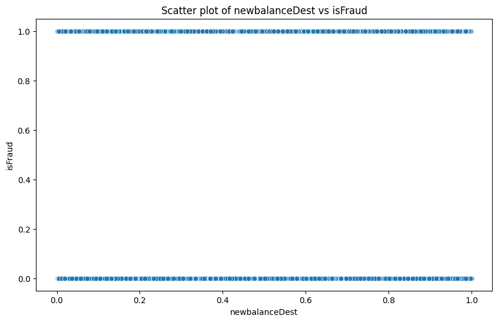
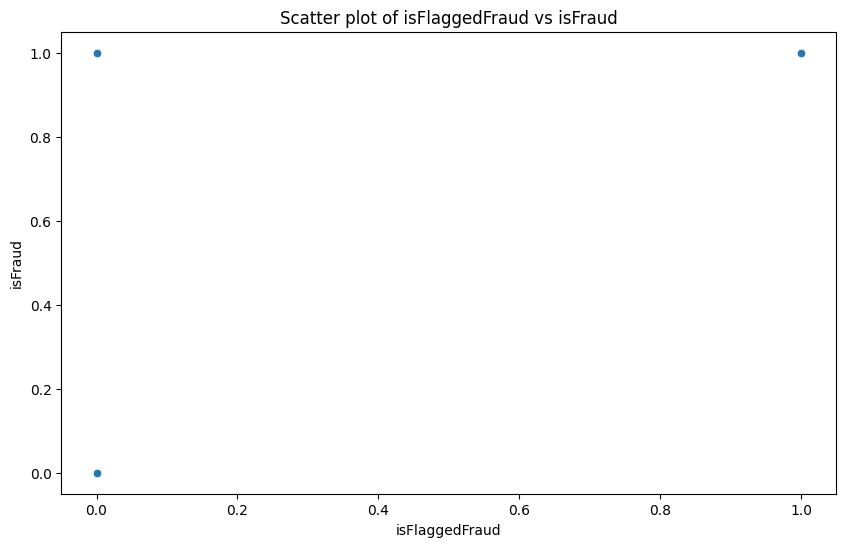

### Target Class Balance
- Class imbalance analysis revealed a **severe bias toward non-fraudulent transactions**.

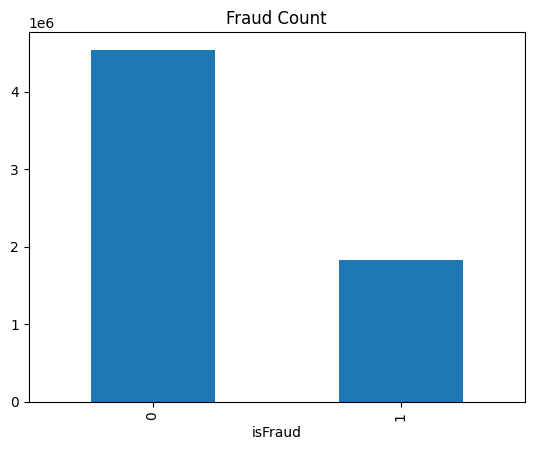

### Model Choices
Based on dataset size and problem type, the following models were selected:
1. **Logistic Regression**
2. **Decision Trees**
3. **Naive Bayes**

## Model Training and Testing
Each model was trained on **scaled data** and tested on the same dataset.

### Logistic Regression
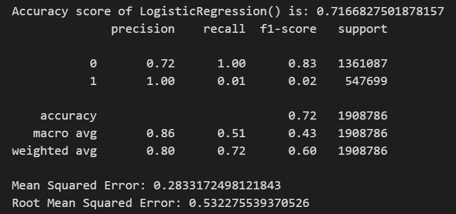
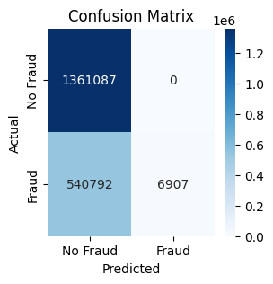

### Decision Trees
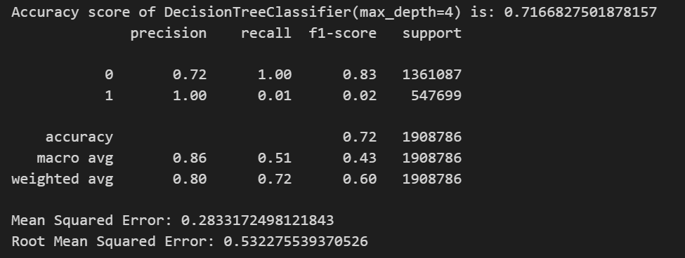

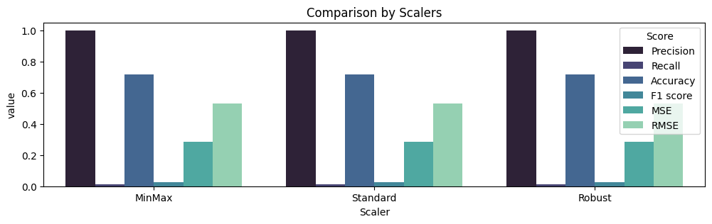

### Naive Bayes
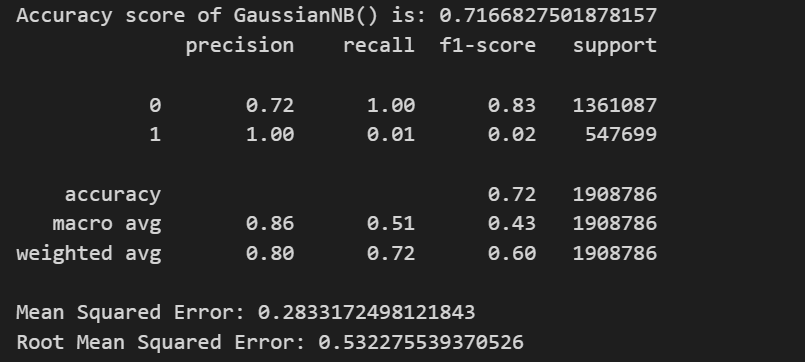

## Conclusion
- **All models struggle to detect fraud due to class imbalance.**
- **Logistic Regression and Naive Bayes** performed slightly better in terms of macro averages.
- **Recall for fraudulent transactions is extremely low (~1%)**.
- **Next Steps**:
  - Apply **oversampling, undersampling, or SMOTE** to balance data.
  - Experiment with **ensemble models (Random Forest, XGBoost, etc.)**.
  - Use **anomaly detection techniques** for fraud detection improvement.

---

### Contributors
- **Md. Dodi Al Fayed**
- **Md. Ashikuzzaman**

---

### References
- Kaggle Dataset: [Online Payment Fraud Detection](https://www.kaggle.com/)

---
